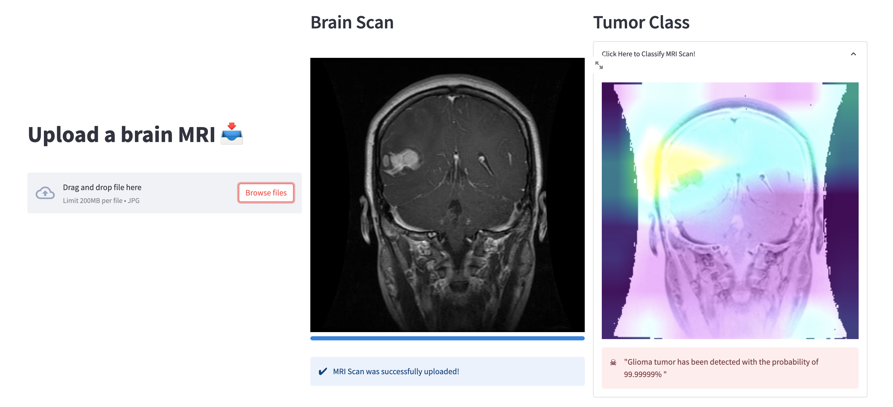

# Braintumorclassification and explainability visualizations through convolutional neural networks and grad-cam

## Main Idea, Reason and Approach of the Project

Convolutional networks have been widely used for the classification of objects in pictures. The use of such algorithms for clinical decision assistants have been on the rise with models performing on par or better than humans in terms of accuracy for diagnosing diseases. However, a frequent concern raised by clinicians relates to the missing explainability of this technology. This private project aims to provide an MVP solution to this problem, adding multiple visualization techniques to the classification made by our model.   
Multiple pre-trained models were tested out via transfer-learning - namely VGG16, EfficientNetV2B3, InceptionNet, and GoogleNet. The model used in the end was EfficientNetV2B3, which reached an accuracy of 97% on our test set. This model was chosen as it represented the best trade-off between accuracy and model size for us. Needless to mention the relevance of accuracy, model-size was an important metric for us since we used MLFlow as the version control system for our model, which had a limit of upload-size.  
The visualization techniques used in the project were grad-cam, activation visualizations, vanillagrad, and occlusion sensitivity maps. Grad-cam turned out to provide us the best results in terms of interpretability.

 <a href="#top">Back to top</a>

## Features

This repository includes the following features:

- Load and preprocess data
- Initiate and train the model
- Evaluate and predict with the model
- Return grad-cam explainability image of prediction and other visualization techniques
- Save the model in MLFlow or Google cloud
- Load the model from MLFlow or Google cloud
- API to get uploaded image through frontend and return prediction and grad-cam image

 <a href="#top">Back to top</a>

## Tech Stack

The following technologies were used in this project:

- Tensorflow.keras
- Tf-explain
- FastAPI
- Uvicorn
- MLflow
- Google cloud storage

 <a href="#top">Back to top</a>

## Installation

To install and run this project, follow these steps:

- Clone the repository
- Install the necessary dependencies using `pip install -r requirements.txt`

 <a href="#top">Back to top</a>

## Usage
To use this project, follow these steps:

- Prepare the dataset and preprocess it using the provided functions
- Initiate, compile, train and evaluate the model through the functions provided in `model.py`
- Use the model to predict on new data and provide explainability visualizations through the functions provided in `predict_and_explain.py`
- To make use of the API as well as saving and loading the model through MLFlow and GCloud, you have to define the corresponding parameters in your `.env` file

 <a href="#top">Back to top</a>

## Contributors

Victor von Eisenhart-Rothe - [LinkedIn](https://www.linkedin.com/in/victor-von-eisenhart-rothe/) - [Github](https://github.com/Victorvone) 
Aurélien Biais - [LinkedIn](https://www.linkedin.com/in/aur%C3%A9lien-biais-a41360a3/) - [Github](https://github.com/abiais)
 
Ivan Andjelkovic - [LinkedIn](https://www.linkedin.com/in/ivan-andjelkovic-b6427029/) - [Github](https://github.com/IvanAndjelkovic)
 
Aydoğan Avcıoğlu - [LinkedIn](https://www.linkedin.com/in/aydo%C4%9Fan-avc%C4%B1o%C4%9Flu-891466173/) - [Github](https://github.com/aydogan22)
 

 <a href="#top">Back to top</a>

